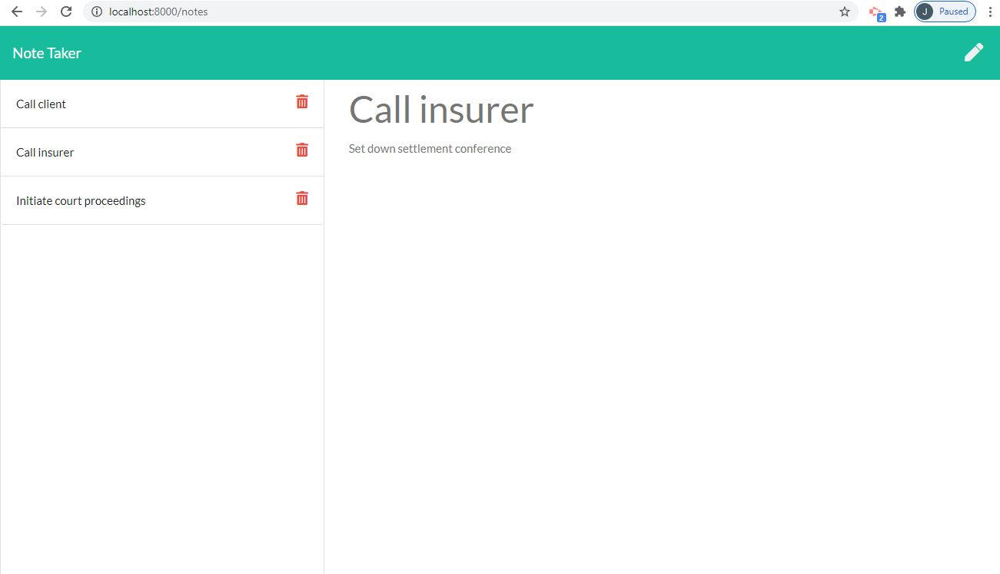

# Note-Taker

## Description
An application that can be used to write, save, and delete notes. This application uses express backend and saves and retrieves note data from a JSON file.

## User Story
AS A user, I want to be able to write and save notes
I WANT to be able to delete notes I've written before
SO THAT I can organize my thoughts and keep track of tasks I need to complete

## Instructions

Application should allow users to create and save notes; view previously saved notes; and delete previously saved notes.

### Home Page

## Deployed Link
[Note Taker](https://______________________________/)

### Issues Encountered

Files from "Developed" folder were deleted and new files were created in the main directory, which has accidentally deleted ALL commitments :( . 

However, past history of commitments can be accessed by clicking on 'server.js' file, then clicking on 'History' at the top right corner, and then clicking on "screenshot added to assets folder and files copy/pasted from develop..." commitment link. This will lead marker to all previous commits' history.